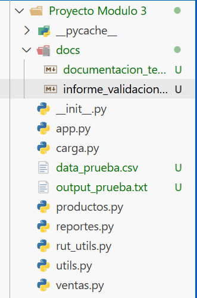
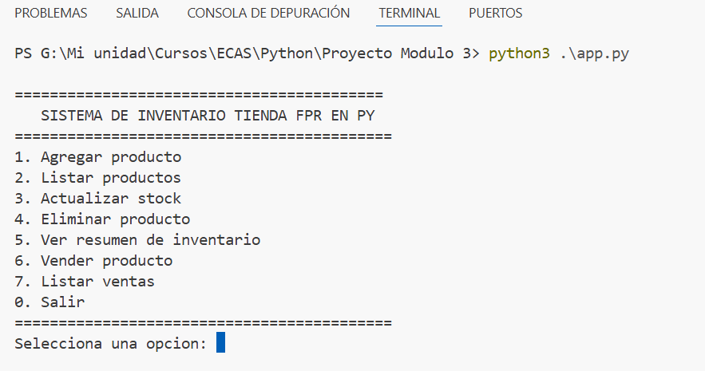
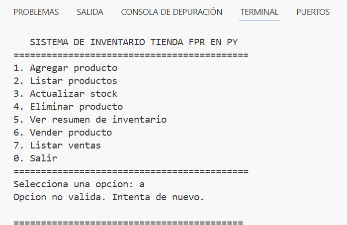
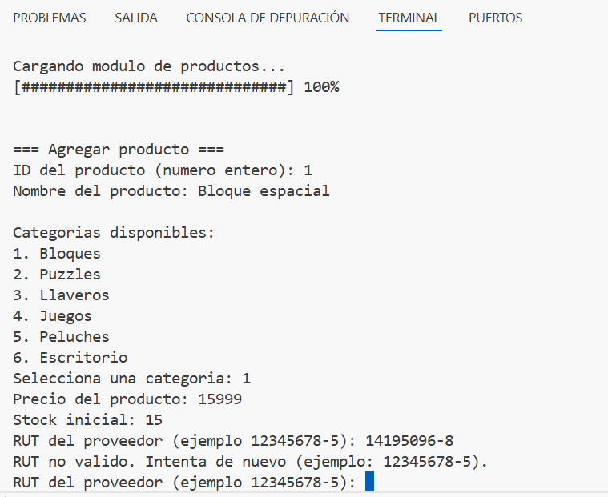
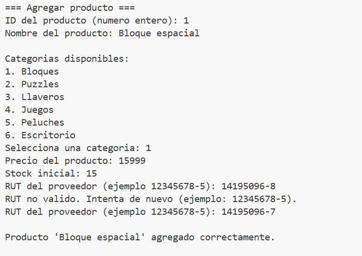
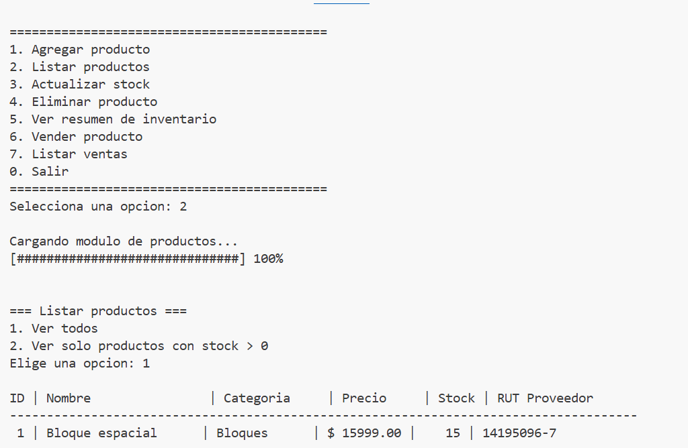
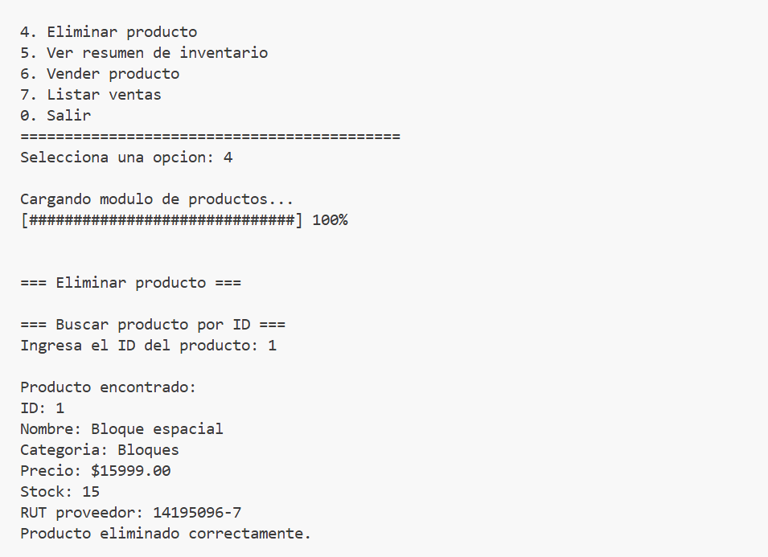
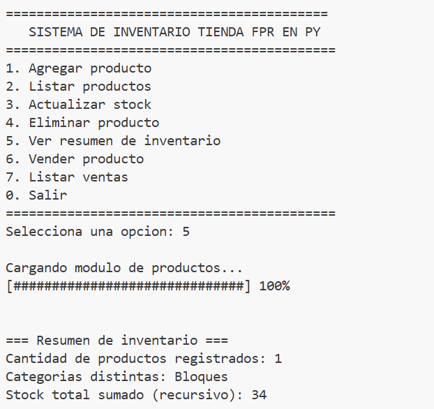

# Informe de Validacion - Proyecto Modulo 3

## 1. Entorno de desarrollo
- SO: Windows
- IDE: Visual Studio Code
- Version Git: 2.52.0.windows.1
- Lenguaje: Python 3.x

## 2. Evidencia de estructura modular

## 3. Evidencia de ejecucion
### 3.1 Menu principal

### 3.2 Validaciones de entrada
- Caso: ingreso de texto cuando se espera entero (leer_entero)

- Caso: RUT invalido y reintento (leer_rut)

### 3.3 Flujo de inventario
- Agregar producto

- Listar productos

- Eliminar producto

### 3.4 Flujo de ventas
- Venta con stock suficiente (rebaja correcta)

- Venta con stock insuficiente (bloqueo)

### 3.5 Reporte / recursividad
- Resumen inventario (stock total recursivo)

## 4. Analisis de desafios y soluciones
- Importaciones de modulos: solucion mediante ejecucion desde carpeta raiz y estructura correcta.
- Validacion de datos: funciones reutilizables en utils.py con try/except.
- Control de stock: validacion previa antes de rebajar y registro en historial.
- RUT: modulo independiente rut_utils.py con algoritmo modulo 11.

## 5. Conclusiones
El sistema cumple los requerimientos del modulo: control de flujo, modularizacion, estructuras de datos, validaciones y recursividad.
